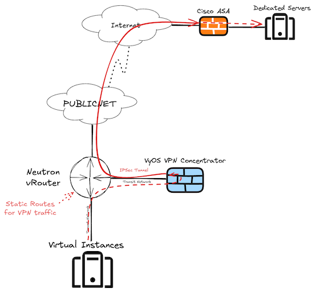

This Terraform example builds the following:

- 1x VyOS VM
- 1x Ubuntu VM
- 1x Neutron router
- 1x keypair used for VyOS and VM(s)
- Supporting Neutron resources



The VyOS VM is placed off the Neutron router and facilitates
an IPSec VPN tunnel between itself and a remote VPN concentrator.

Traffic from the Ubuntu VM will hairpin through the VyOS VM
thanks to a route(s) placed on the Neutron router for
interesting (vpn) traffic.

[! NOTE]
The example here configures a route-based tunnel.

To use this Terraform example, install OpenTofu or Terraform and modify
accordingly. Variables can be set in `terraform.tfvars`.

Run the following to deploy a demo environment with OpenStack Flex:

```
  tofu init
  tofu apply
```

To proceed with the IPSec tunnel configuration, change to the `ansible`
directory and read the README.
